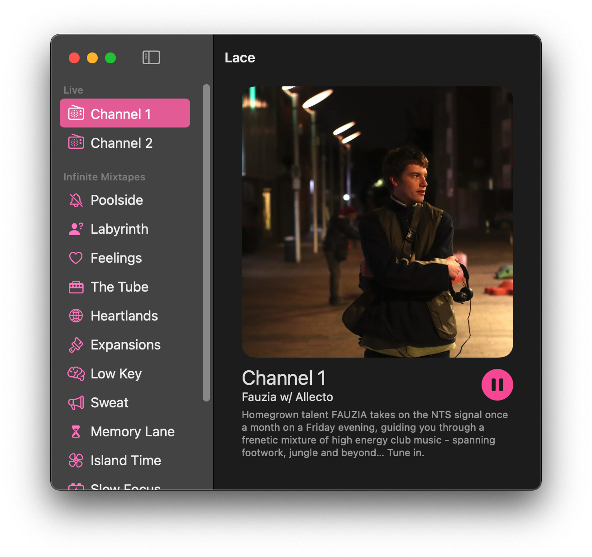

# Marconio

A simple macOS (and maybe iOS) application to listen to [NTS](https://nts.live) through.

NTS is listener supported, please consider donating to them as it's a fantastic service. You can donate with the button below!

[Donate!](https://www.nts.live/supporters)

# What is Marconio?
It's nothing, but this project used to be called Lace, but in order to ship to the app store you have to pick a name that isn't already taken. So in an reference to [Guglielmo Marconi](https://en.wikipedia.org/wiki/Guglielmo_Marconi) this is now called Marconio.

