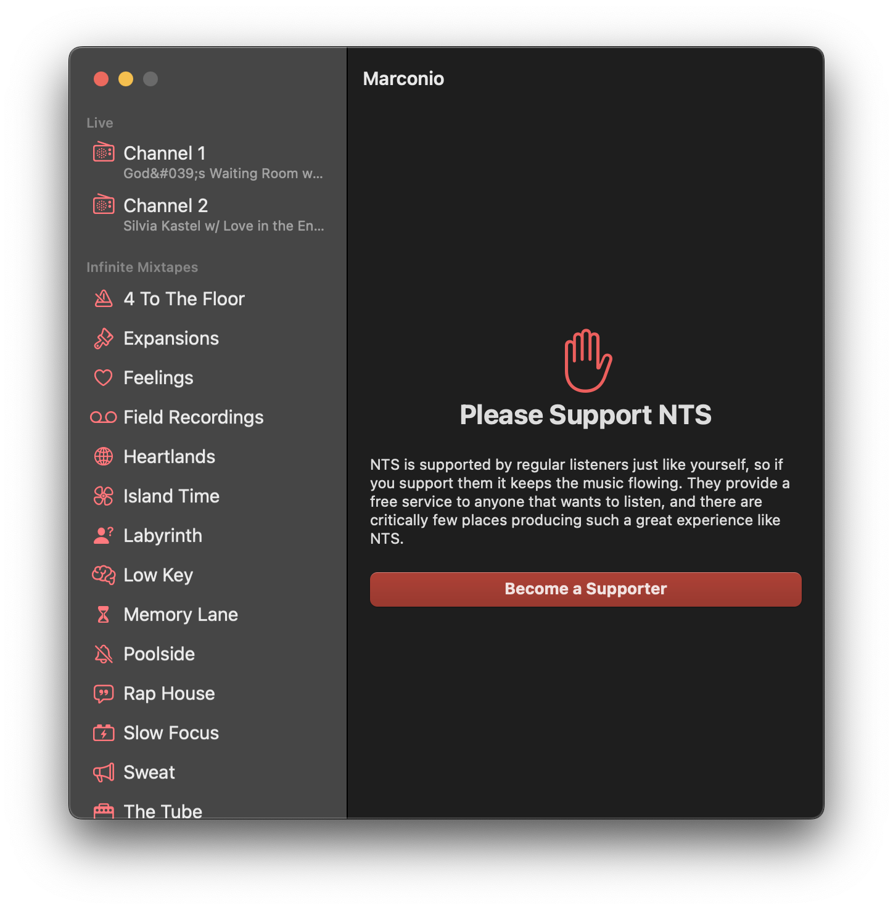
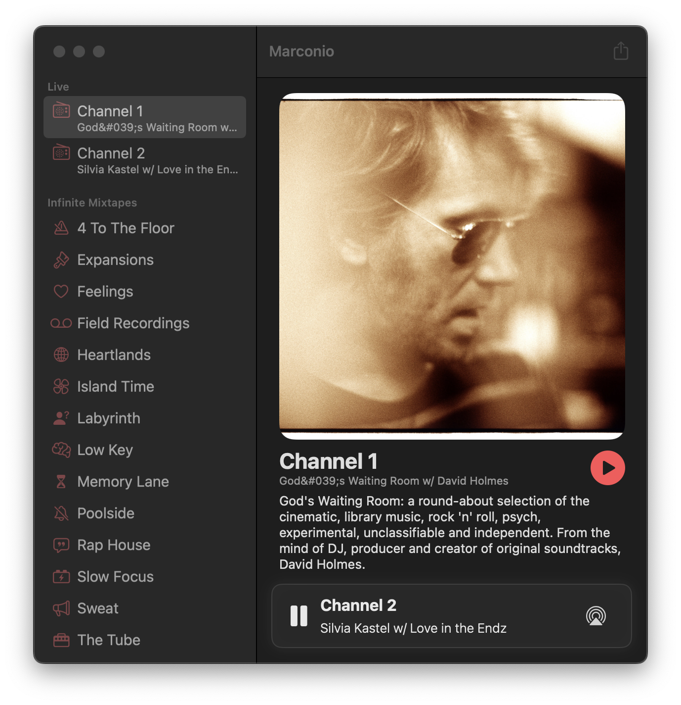
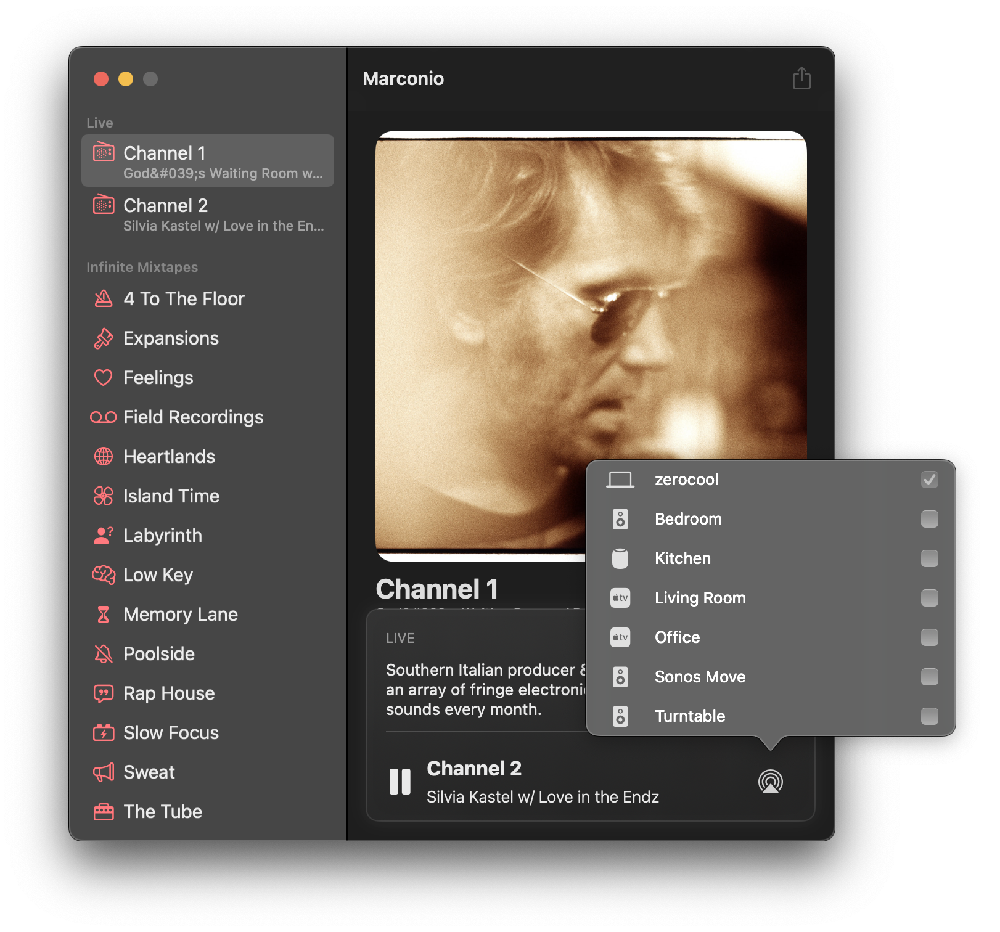

## About

Marconio is a basic app that lets you stream the wonderful live channels and mixtapes from [NTS](https://nts.live).

It integrates with the macOS level command center now playing widget, as well as the standard play/pause keyboard hot keys and shortcuts. It should feel very similar to any other audio playback app that you've used in the past, just focused to the content on NTS.

If you lke this app, you should support NTS as they are providing an excellent service for free.

**[Support NTS](https://www.nts.live/supporters)**

## Download

If you'd like to download Marconio, head on over to the [latest release page](https://github.com/brianmichel/Marconio/releases/latest) and download the `.dmg` attached to the release.

This app uses Sparkle to keep itself up to date. After you've installed one version of Marconio from the releases page you can continue to update to later versions from within the app.

## Screenshots

